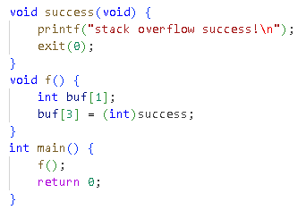
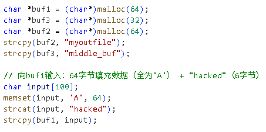
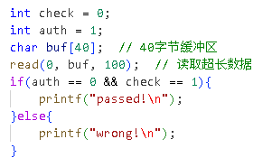
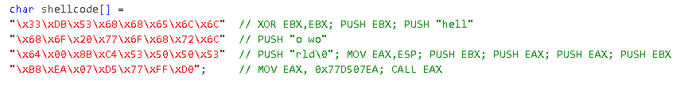
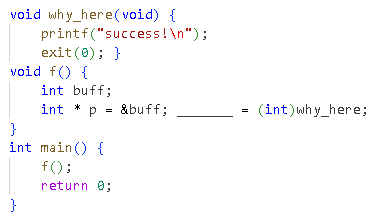
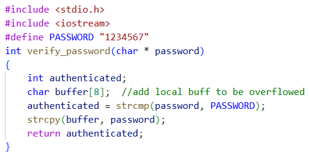

软件安全课程课后题

选择（10题）

1、下列关于溢出漏洞概念的描述，正确的是（ ）

1. 缓冲区溢出仅能发生在栈区，堆区不存在溢出风险
2. 缓冲区溢出是向固定大小缓冲区写入超容量数据，覆盖相邻内存空间
3. C/C\+\+ 语言的所有函数都会自动进行数组边界检查，避免溢出
4. 溢出后执行的代码会以攻击者指定的权限运行，与原程序权限无关

解析：B。缓冲区溢出可发生在栈区和堆区，A 错误；C/C\+\+ 的 strcpy 等函数无自动边界检查，C 错误；溢出代码以原程序权限运行，D 错误

2、栈溢出漏洞的核心特征是（ ）

1. 数据从高地址向低地址填充，覆盖栈帧关键数据
2. 被调用函数中写入数据长度超过栈帧预留的局部变量空间
3. 仅能通过覆盖临接变量实现攻击，无法篡改返回地址
4. 栈溢出漏洞仅存在于静态链接的程序中

解析：B。栈溢出数据从低地址向高地址填充，A 错误；可覆盖返回地址，C 错误；动态链接程序也可能存在栈溢出，D 错误

3、关于堆溢出漏洞，下列说法错误的是（ ）

1. 堆溢出是发生在堆区的缓冲区溢出，在很多传统场景下利用难度高于栈溢出
2. 堆溢出可通过覆盖堆管理结构（如 freelist 链表指针）实现攻击
3. Dword Shoot 攻击是堆溢出的典型利用方式，可向任意地址写入数据
4. 堆块分配后地址固定，不受程序运行状态影响

解析：D。堆块分配地址受程序运行状态和内存管理机制影响，并非固定

4、下列不属于 “内存覆盖型溢出漏洞” 的是（ ）

1. SEH 结构溢出
2. 单字节溢出
3. 整数溢出
4. 栈帧 EBP 覆盖溢出

解析：C。整数溢出属于独立漏洞类型，不属于溢出漏洞

5、漏洞利用（exploit）的核心目的是（ ）

1. 仅发现程序漏洞，不执行任何攻击操作
2. 劫持进程控制权，执行植入的 shellcode 或达成攻击目标
3. 修复程序漏洞，提升系统安全性
4. 仅获取目标系统的硬件信息，不影响程序运行

解析：B。漏洞利用的核心是劫持进程控制权，A 为漏洞扫描，C 为漏洞修复，均不符合

6、已知该 32 位程序关闭栈保护，函数f（）栈帧中 buf、保存的 EBP、返回地址按题图所示连续排列，且写入偏移已知。已知栈溢出漏洞代码如下：

该程序的运行结果是（ ）

1. 程序正常退出，无任何输出
2. 输出 “stack overflow success” 后退出
3. 程序崩溃
4. 进入死循环

解析：B。栈结构 = buf → EBP → 返回地址，buf\[3\]精准覆盖返回地址，跳转到success执行。

7、已知三块堆缓冲区连续排列且地址从低到高依次为 buf1、buf3、buf2，程序运行后buf3,和buf2的内容分别为（）

1. buf3="middle\_buf"，buf2="myoutfile"
2. buf3 被全 'A' 覆盖，buf2="hacked"
3. buf3="hacked"，buf2="myoutfile"
4. buf3="myoutfile"，buf2="middle\_buf"

解析：C。malloc在堆内存上分配，buf1被‘A’填满，后续 6 字节 "hacked" 溢出到 __buf3 的前 6 字节，且strcat会在末尾添加‘\\0’因此buf3末尾的‘\_buf’不会被识别到__。

8、在int为4字节的程序里，栈中相邻布局按地址从低到高为 buf\[40\] \-> auth \-> check，向buf输入__40 字节填充数据 \+ 0x00000001 \+ 0x00000000__，程序运行结果是（）

1. passed\!
2. wrong\!
3. 程序崩溃
4. 无输出

解析：B。buf 大小 40 字节，偏移 40 字节到达其他变量，输入数据依次覆盖auth=1、check=0,最终变量值并没有变化。

9、程序运行结果是（ ）

1. 弹出标题为 "hello world"、内容为 "hello world" 的消息框
2. 弹出标题为空、内容为 "hello" 的消息框
3. 直接打开命令行 shell
4. 程序无响应

解析：A。先构造字符串 "hello world" 并压栈，再按从右向左顺序压入 MessageBoxA 的 4 个参数（EBX=0 即 hWnd=NULL，EAX 指向字符串首地址即 lpText 和 lpCaption=hello world，EBX=0 即 uType = 默认风格

10、已知f（）函数栈帧中局部变量与控制信息按地址从低到高依次为：buff、保存的 EBP、返回地址，且 int 占 4 字节。下列代码中，能通过栈溢出覆盖返回地址实现调用 why\_here 函数的是（ ）

1. \*p
2. \*\(p\+1\)
3. \*\(p\+2\)
4. \*\(p\-1\)

解析：C。栈中 buff 地址、EBP、返回地址依次排列，p\+2 指向返回地址

填空（3题）

11、堆溢出漏洞代码填空：已知 buf1 和 buf2 为堆区连续分配的缓冲区（buf1 后紧接 buf2），buf1和buf2的长度分别len1和len2，若想将长度为len3的内容通过 buf1 溢出覆盖写入 buf2 ，需输入的字符串长度为\_\_\_\_\_\_\_。

解析：len1\+len3。需要先使用长度为len1的字符串先填满buf1，再紧接长度为len3的内容。

12、Shellcode 代码植入填空：调用 MessageBoxA 函数时，需按从右向左的顺序压入 4 个参数，依次为\_\_\_\_\_\_\_、\_\_\_\_\_\_\___、\_\_\_\_\_\_\_\___、\_\_\_\_\_\_\_（填写参数名称，按压栈顺序）。

解析：uType、lpCaption、lpText、hWnd

1. 栈溢出漏洞代码填空：

在 verify\_password 函数中，buffer 缓冲区大小为 8 字节，要开始覆盖 authenticated 变量，需输入至少\_\_\_\_\_\_\_字节的字符串（含字符串结束符）。  
解析：9。buffer 为 8 字节，输入前 8 个字节填满 buffer，第 9 个字节（字符串结束符 \\0）开始写入相邻的 authenticated 变量。

简答（3道）

1. 请简述除缓冲区溢出外的其它典型软件漏洞（至少列举 3 种），并说明每种漏洞的核心特征。

答案：（1）格式化字符串漏洞：因格式化函数（如 printf）未校验格式化字符串与参数的匹配性，攻击者可通过控制 format 参数实现数据泄露或任意地址写入；（2）整数溢出漏洞：整数运算 / 存储时超出其数据类型范围，导致数值异常，常被用于绕过程序条件检测；（3）攻击 C\+\+ 虚函数：通过篡改虚表指针或虚表中的函数地址，使程序调用虚函数时执行恶意 shellcode；（4）注入类漏洞（如 SQL 注入）：外部输入被当作代码执行，破坏应用程序逻辑。

1. 请列举 Windows 操作系统中的 5 种主要安全防护技术，并简要说明每种技术的防护原理。

答案：（1）ASLR：随机化 DLL 加载地址、栈 / 堆地址等关键地址，使攻击者无法获取精准跳转地址；（2）GS Stack Protection：在缓冲区与返回地址间加入 security\_cookie，函数返回时校验，检测栈溢出；（3）DEP：将栈 / 堆等敏感区域标记为不可执行，阻止注入代码运行；（4）SafeSEH：编译时生成合法 SEH 函数表，运行时校验异常处理函数的合法性；（5）SEHOP：检测 SEH 链表完整性，阻止 SEH 覆盖攻击。

1. 请简述 3 种绕过 Windows 安全防护的进阶漏洞利用技术，并说明每种技术的核心思路。

答案：（1）ROP（返回导向编程）：复用已加载模块中的指令片段（Gadget）构建恶意代码，绕过 DEP；（2）堆喷洒技术：在 shellcode 前加大量 NOP 滑板指令，向堆中填充注入代码，降低地址跳转精度要求；（3）API 函数自搜索技术：shellcode 动态定位 kernel32\.dll 及所需 API 地址，绕过 ASLR 导致的地址随机化；（4）利用未开启 SafeSEH 的模块：以未启用 SafeSEH 的模块为跳板，覆盖 SEH 函数指针，绕过 SafeSEH 防护。

