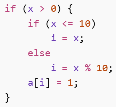
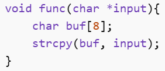
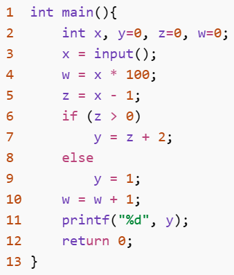

软件安全课程课后题

# 一、选择题（6题）

__1\. 在一次漏洞挖掘任务中，安全分析人员首先使用静态分析工具扫描程序，发现多个可能存在缓冲区溢出的危险函数调用，但其中一部分在实际运行中并不会被触发。随后他使用模糊测试运行程序，成功复现了其中一个溢出漏洞。关于该过程，下列说法最合理的是：__

A\. 静态分析一定比动态分析准确

B\. 动态分析不需要运行程序

C\. 静态分析通常效率较高，但可能误报；动态分析准确率较高，但依赖运行环境

D\. 符号执行只能属于动态分析

__答案：C__

__解析：__静态分析不运行程序，通常效率高、资源消耗低，但由于缺少真实运行环境信息，可能存在误报和漏报。动态分析需要运行程序，能够观察真实执行行为，因此准确率通常较高，误报较低，但依赖测试输入、运行环境和路径覆盖情况。

A 错在“静态分析一定更准确”；B 错在动态分析需要运行程序；D 错在符号执行既可以有静态形式，也可以有动态符号执行形式。

__2\. 某程序中存在如下逻辑：__

__若数组 a 长度为10，下列判断最合理的是：__

A\. 一定不存在数组越界

B\. 当 x = 10 时可能发生越界

C\. 只有 x > 10 时才可能越界

D\. 符号执行无法分析该问题

__答案：B__

__解析：__数组 a 长度为10，合法下标为 0~9。当 x > 0 且 x <= 10 时，i = x。如果 x = 10，则执行 a\[10\] = 1，访问了数组边界之外的位置，因此可能发生越界。课件中的示例也指出，路径约束 x > 0 ∧ x <= 10 与越界条件 x >= 10 联合后有解，x = 10 即可触发越界。

C 错在 x > 10 时会执行 x % 10，结果通常落在 0\-9 范围内；D 错在符号执行正适合分析这类路径约束与漏洞条件组合问题。

__3\. 关于污点分析，下列说法错误的是：__

A\. 污点源通常是不可信输入

B\. Sink 点通常是敏感操作位置

C\. 常值赋值可能清除污点

D\. 污点分析只能发现缓冲区溢出漏洞

__答案：D__

__解析：__污点分析的核心是标记不可信输入，并跟踪其在程序中的传播过程，最后在敏感操作位置进行检测。污点源通常是文件、网络数据、用户输入等不可信数据；Sink 点通常是程序跳转、系统函数调用、数据库查询、命令执行等敏感位置。

D 错在污点分析并不只用于缓冲区溢出，还可用于 SQL 注入、命令注入、路径穿越、控制流劫持等由外部输入触发的问题。

__4\. 关于程序切片，下列说法正确的是：__

A\. 前向切片关注“哪些语句影响了目标变量”

B\. 后向切片关注“目标变量会影响哪些后续语句”

C\. 动态切片通常比静态切片更关注特定输入下的实际执行路径

D\. 静态切片必须运行程序才能完成

__答案：C__

__解析：__动态切片需要考虑特定输入，其切片准则通常包含输入集合，因此它更关注某一次具体执行中实际经过的路径。

A、B 的方向说反了：前向切片关注某变量或语句会影响哪些后续语句；后向切片关注哪些语句影响了目标变量或目标位置。D 错在静态切片不要求实际运行程序。

__5\. 关于程序插桩技术在漏洞挖掘中的应用，下列说法最合理的是：__

A\. 插桩的主要作用是修改程序逻辑，使其更安全

B\. 插桩可以通过在程序中插入额外代码来收集运行时信息，如函数调用或变量变化

C\. 插桩只能在程序源代码层面进行，无法作用于二进制程序

D\. 插桩不会对程序运行产生任何性能影响

__答案：B__

__解析：__程序插桩的核心思想是在程序中插入额外的代码（探针），以便在程序运行过程中收集相关信息。这些信息可以包括函数调用情况、变量变化、控制流路径以及内存访问行为等。在漏洞挖掘中，插桩技术常用于动态分析阶段，用于观察程序的实际执行过程，从而辅助发现潜在漏洞。

A 错在将插桩理解为用于修改程序逻辑，实际上插桩主要用于收集运行信息，而不是修复漏洞。C 错在认为插桩只能作用于源代码，实际上也可以作用于二进制程序，甚至在运行时动态插入。D 错在忽略了性能开销，插桩通常需要执行额外代码，会对程序运行产生一定影响。

__6\. 渗透测试中，为什么信息收集阶段往往被认为非常关键？__

A\. 因为信息收集可以直接绕过所有安全防护机制

B\. 因为后续漏洞分析、攻击路径选择高度依赖前期掌握的信息

C\. 因为信息收集的主要目的是隐藏攻击者身份

D\. 因为只要完成信息收集，就不需要漏洞分析

__答案：B__

__解析：__信息收集阶段的核心作用在于全面了解目标系统，包括系统版本、网络结构、开放端口及服务等信息。这些信息直接决定了后续漏洞分析的方向以及攻击路径的选择，是制定攻击策略的基础。

A 错在夸大信息收集作用，它本身不能直接绕过防护。C 错在混淆概念，隐藏身份属于隐蔽性策略，而不是信息收集的核心目的。D 错在信息收集不能替代漏洞分析，两者是不同阶段。

# 二、填空题（4题）

__7\. 在符号执行过程中，用于表示程序执行路径约束条件的变量通常称为 \_\_\_\_\_\_。__

__解析：__路径约束条件

__8\. 污点分析中，将不可信输入数据标记为 \_\_\_\_\_\_，用于跟踪其在程序中的传播过程。__

__解析：__污点

__9\. 程序依赖图（PDG）中包含两类主要依赖关系：\_\_\_\_\_\_依赖 和 \_\_\_\_\_\_依赖。__

__解析：__数据依赖；控制依赖

__10\.__ __阅读以下代码：__

__（1）该代码存在的主要安全漏洞是 \_\_\_\_\_\_。__

__（2）该漏洞产生的直接原因是 \_\_\_\_\_\_。__

__（3）当输入数据长度大于 \_\_\_\_\_\_ 字节时，一定会发生越界写入。__

__解析：__（1）缓冲区溢出（或栈溢出）

（2）strcpy未进行边界检查（或未限制输入长度）

（3）8

__11\.__ __阅读以下代码：__

__（1）以 printf\("%d", y\) 中的变量 y 为目标，进行静态切片，得到的语句编号为：\_\_\_\_\_\_\_\_\_\_\_\_\_\_\_\_\_\_\_\_\_\_\_\_\_\_\_\_\_\_\_\_\_\_\_\_\_\_\_\_\_\_。__

__（2）若输入为 x = 1，进行动态切片，得到的语句编号为：\_\_\_\_\_\_\_\_\_\_\_\_\_\_\_\_\_\_\_\_\_\_\_\_\_\_\_\_\_\_\_\_\_\_\_\_\_\_\_\_\_\_。__

__请按语句编号从小到大填写，用逗号分隔。__

__解析：__（1）2,3,5,6,7,8,9,11

（2）2,3,5,6,8,9,11

# 三、简答题（3题）

__12\. 简述符号执行如何用于发现数组越界漏洞。__

__答案：参考答案见下__

__解析：__符号执行可以将程序输入变量符号化，例如将用户输入 x 表示为符号变量 X。随后，符号执行引擎模拟程序执行过程，在每个条件分支处记录路径约束。例如遇到 if \(x > 0\) 时，进入 then 分支会记录约束 X > 0，进入 else 分支会记录约束 X <= 0。

当程序执行到数组访问语句，例如 a\[i\] = 1 时，分析器会根据路径上变量 i 的符号表达式判断是否可能越界。如果数组长度为10，则合法访问条件为 0 <= i < 10，越界条件可以表示为 i < 0 或 i >= 10。符号执行会把路径约束与越界条件组合起来，交给约束求解器求解。

如果求解器返回有解，说明存在某组输入可以到达该路径并触发越界访问。

__13\. 简述程序切片在漏洞挖掘中的作用。__

__答案：参考答案见下__

__解析：__程序切片是一种程序分解技术，它根据给定的切片准则，从程序中提取与目标变量或目标语句相关的代码片段。对于大型程序，安全分析人员通常不可能人工审查全部代码。程序切片可以帮助分析人员围绕敏感函数、危险变量、外部输入等兴趣点缩小分析范围，从而提高漏洞挖掘效率。

__14\. 简述渗透测试 PTES 七阶段, 并说明“报告阶段”的重要性。__

__答案：参考答案见下__

__解析：__PTES 将渗透测试过程划分为七个阶段：

1. 前期交互阶段：与客户确认测试范围、目标、限制条件、授权和合同细节。 
2. 情报搜集阶段：收集目标组织、域名、网络、系统、人员、服务等信息。 
3. 威胁建模阶段：基于已收集信息分析可能攻击面，规划攻击路径。 
4. 漏洞分析阶段：分析目标系统可能存在的漏洞，并验证可利用性。 
5. 渗透攻击阶段：利用漏洞获取访问控制权或证明风险存在。 
6. 后渗透攻击阶段：在授权范围内进一步分析影响，如权限提升、横向移动、敏感信息获取等。 
7. 报告阶段：整理测试过程、发现的问题、攻击路径、影响分析和修复建议。 

报告阶段的重要性在于，渗透测试最终目的不是“攻击成功”，而是帮助被测方理解风险并改进安全体系。高质量报告应包括漏洞证据、复现条件、影响范围、风险等级、修复建议和加固方案，使管理人员和技术人员都能据此采取行动。

