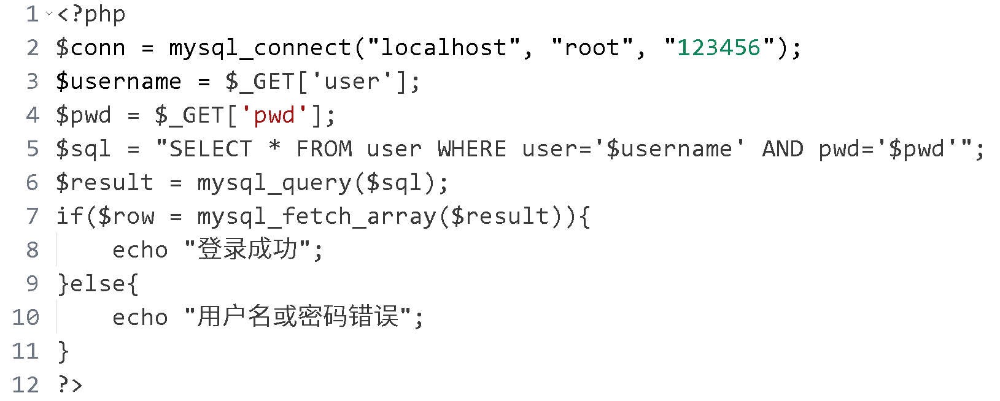
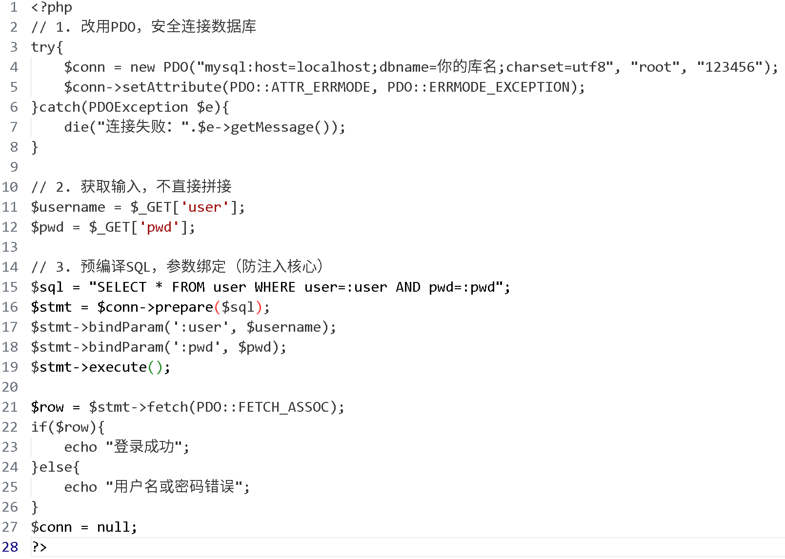

软件安全课程课后题

# 选择（10题，50分）

__1、关于HTTP协议的特性，下列说法正确的是（A）__

A\.HTTP是无状态的通信协议

B\.HTTP每次请求响应后会断开TCP连接

C\.HTTP默认传输数据经过加密处理

D\.HTTP无法传输图片、视频等非文字资源

__2、下列关于Cookie和Session的区别，错误的是（D）__

A\.Cookie存储在客户端浏览器，Session存储在服务器

B\.Cookie可设置过期时间，关闭浏览器后可保留

C\.SessionID通常通过Cookie传递，用于识别用户会话

D\.Session关闭浏览器后一定不会失效

__3、关于HTTP的GET和POST请求，说法错误的是（D）__

A\.GET请求数据附在URL后，POST请求数据放在请求体中

B\.GET参数更容易暴露在URL、历史记录、日志中，易泄露账号密码

C\.GET可用于查询资源，POST可用于提交、更新数据

D\.GET请求参数不会被浏览器缓存，POST会缓存

__4、下列不属于OWASP十大WEB安全威胁的是（C）__

A\.SQL注入

B\.跨站脚本（XSS）

C\.跨站请求伪造（CSRF）

D\.会话劫持

__5、下列哪项不属于Web注入类漏洞（D）__

A\.SQL注入

B\.XSS跨站脚本

C\.文件包含漏洞

D\.跨站请求伪造（CSRF）

__6、SQL注入产生的根本原因是（B）__

A\.服务器配置错误

B\.未使用参数化查询，导致用户输入与 SQL 代码混合拼接执行

C\.数据库版本过低

D\.网络环境不安全

__7、测试SQL注入时，常用的“单引号法”是为了（B）__

A\.绕过登录验证

B\.触发SQL语法错误，判断是否存在注入

C\.直接查询数据

D\.关闭数据库

__8、存在SQL注入的URL：?id=1'and1=1 \#，其中\#的作用是（A）__

A\.注释掉后面的 SQL 内容

B\.加密传输

C\.强制查询

D\.无意义

__9、PHP代码：$sql="select \* from user where id="\.$\_GET\['id'\];，该代码存在注入，主要原因是（B）__

A\.数据库名写错

B\.未对$\_GET\['id'\]过滤，直接拼接SQL

C\.表名错误

D\.使用了错误函数

__10、以下哪项属于远程文件包含漏洞（RFI）的利用条件？（C）__

A\.PHP配置allow\_url\_include=Off

B\.直接包含本地服务器的日志文件

C\.PHP配置allow\_url\_fopen=On且allow\_url\_include=On

D\.仅能包含\.php后缀文件

# 填空（5题，20分）

1、HTTP会话管理中__Cookie__存于客户端，__Session__存于服务器。

2、HTTP协议中，用于获取资源的请求方法是__GET__，用于提交数据的常用方法是__POST__。

3、SQL注入中，' or 1=1 \-\-属于永真式注入，作用是__绕过登录验证__。

4、SQL盲注是不能通过直接显示的途径来获取数据库数据的方法。一般情况下盲注分为三类：__基于布尔的SQL盲注，基于时间的SQL盲注，基于报错的SQL盲注__。

5、PHP反序列化漏洞的核心成因是__用户可控__的参数直接传入__unserialize\(\)__函数，触发魔术方法执行恶意代码。

# 简答（3道，30分）

__简述Cookie和Session配合实现HTTP会话管理的核心原理。__

答：服务器首次接收用户请求时，生成唯一的SessionID并创建Session存储用户数据；服务器通过响应头将SessionID以Cookie形式发送到客户端；客户端后续请求时，浏览器自动携带该Cookie（含SessionID）；服务器通过SessionID匹配对应Session，识别用户身份，实现无状态HTTP协议下的会话保持。

__下面是一段存在安全问题的PHP代码，请回答：（1）当前代码存在哪些安全漏洞（2）漏洞成因（3）如何修改为安全代码__

答：（1）存在漏洞SQL注入漏洞、数据库连接明文密码、使用废弃函数mysql\_\*。（2）漏洞成因直接将$\_GET\['user'\]和$\_GET\['pwd'\]未过滤、未转义，直接拼接到SQL语句；用户可构造恶意参数（如user=admin'or1=1\#）篡改SQL逻辑，绕过登录、查数据；数据库账号密码硬编码，泄露风险高；mysql\_\*函数已废弃，不安全。

（3）使用PDO预编译

参考修改示例：  

__请简要说明文件包含漏洞的核心定义、两种主要类型，以及产生的根本原因。__

答：1\.核心定义：文件包含漏洞是指Web应用通过include/require等函数引入文件时，未过滤用户可控的文件路径，导致可引入任意文件（本地/远程）并执行代码的漏洞。2\.两种类型：本地文件包含（LFI，包含服务器本地文件）、远程文件包含（RFI，包含外部URL恶意文件）。3\.根本原因：未对传入include/require函数的文件路径做白名单限制、路径过滤，用户可构造恶意路径控制文件引入行为。

